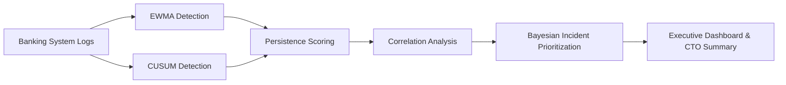
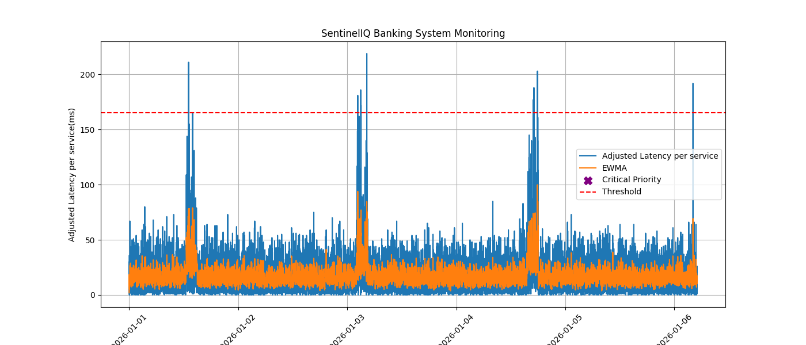

# SentinelIQ

Intelligent Banking Log Intelligence & Incident Detection Platform

It combines statistical anomaly detection, reducing MTTP in Financial Systems Through Statistical Observability,  persistence analysis, and probabilistic incident prioritization to proactively identify operational risks in banking infrastructure.

## Overview

Modern banking and investment systems process millions of events every minute.
A few unnoticed anomalies in latency, transaction processing, or infrastructure health can cascade into large-scale outages, failed trades, delayed payments, and customer-impacting incidents.

SentinelIQ is a production-inspired statistical observability platform designed to proactively detect operational degradation before it affects critical financial systems.

The platform combines:
Statistical anomaly detection
Incident persistence analysis
Correlation intelligence
Bayesian prioritization

to generate actionable insights and executive-level operational summaries.

## Table of Contents

1. [Key Objectives](#key-objectives)
2. [Core Detection Intelligence](#core-detection-intelligence)
3. [Technical Stack](#technical-stack)
4. [System Architecture](#system-architecture)
5. [Example Executive Summary](#example-executive-summary)
6. [Business Impact](#business-impact)
7. [Future Enhancements](#future-enhancements)
8. [SEO Keywords](#seo-keywords)
9. [Final Note](#final-note)

## Key Objectives

1. Detect hidden infrastructure anomalies early
2. Reduce MTTP (Mean Time To Prevention)
3. Minimize alert fatigue and false positives
4. Correlate failures across system components
5. Prioritize incidents intelligently
6. Generate CTO-friendly operational insights

[↑ Back to Table of Contents](#table-of-contents)

## Financial System Use Cases

SentinelIQ can monitor:
1. Payment gateway infrastructure
2. Core banking APIs
3. Trading engines
4. Investment platforms
5. Fraud detection pipelines
6. Authentication services
7. Kafka consumer lag
8. Database performance degradation

   [↑ Back to Table of Contents](#table-of-contents)

   
## Core Detection Intelligence

1. **EWMA Drift Detection**

EWMA detects gradual behavioral shifts before systems reach failure thresholds.

Useful for:

API latency increase
CPU drift
Transaction processing slowdown

$$
\text{EWMA}_t = \alpha x_t + (1-\alpha)\text{EWMA}_{t-1}
$$

2. **CUSUM Deviation Detection**

CUSUM identifies cumulative deviations from expected operational baselines.

Useful for:

1. Silent degradation
2. Queue accumulation
3. Gradual infrastructure instability

$$   
S_t = \max(0, S_{t-1} + (x_t - \mu - k))
$$

3. **Persistence Scoring**

Short spikes may be noise.
Persistent anomalies indicate systemic risk.

persistence_score = anomaly_duration * severity

4. **Correlation Intelligence**
   
Correlates anomalies across:

1. Latency
2. Error spikes
3. CPU saturation
4. Service degradation

This improves root-cause visibility.

5. **Bayesian Incident Prioritization**

Assigns probabilistic operational risk scores using:

1. Persistence2
2. Severity
3. Historical behavior
4. Correlated failures
   
$$   
P(A|B) = \frac{P(B|A)P(A)}{P(B)}
$$

| Signal | Meaning |
| --- | --- |
| EWMA alert | Short-term drift |
| CUSUM alert | Cumulative degradation |
| Persistence score | Sustained Issue |
| ML anomaly | Learned abnormality |
| Incident probability | Bayesian importance |
| Severity | Operational Impact |
| Queue lag | Customer Impact |
| Latency | Service degradation |

[↑ Back to Table of Contents](#table-of-contents)

## Technical Stack

| Component        | Technology              |
| :--------------- | :---------------------- |
| Language         | Python                  |
| Environment      | Google Colab            |
| Data Processing  | Pandas, NumPy           |
| Visualization    | PyPlot                  |
| Detection Engine | EWMA + CUSUM            |
| Risk Scoring     | Bayesian Prioritization |
| Analytics        | Correlation Analysis    |
| Reporting        | Automated CTO Summary   |

[↑ Back to Table of Contents](#table-of-contents)

## System Architecture

[↑ Back to Table of Contents](#table-of-contents)

## Example Executive Summary

### SENTINELIQ OPERATIONAL SUMMARY

Critical anomaly windows detected:
- 06:40 to 07:25
- 11:40 to 12:35

Observed patterns:
- Sustained API latency increase
- Elevated transaction failures
- CPU saturation trends

Correlation Findings:
- Latency strongly correlated with CPU usage
- Error bursts aligned with latency spikes

Incident Prioritization:
- 14 Critical incidents
- 22 Medium incidents

Operational Risk Level:
HIGH

Recommended Action:
Investigate payment processing cluster
and database connection pooling.

[↑ Back to Table of Contents](#table-of-contents)

## Business Impact

| Metric                  | Traditional Monitoring | SentinelIQ |
| :---------------------- | :--------------------- | :--------- |
| Detection Time          | 35 mins                | 5 mins     |
| False Positives         | High                   | Reduced    |
| Root Cause Visibility   | Limited                | Improved   |
| Incident Prioritization | Manual                 | Automated  |
| MTTP                    | Slow                   | Faster     |

[↑ Back to Table of Contents](#table-of-contents)

## Future Enhancements

- ML-based anomaly detection using Isolation Forest
- Similar incident retrieval using vector embeddings
- AI-powered root cause analysis
- Predictive outage forecasting
- LLM-assisted remediation recommendations
   
[↑ Back to Table of Contents](#table-of-contents)

## SEO Keywords   

AI Observability,
Banking Log Intelligence,
Anomaly Detection,
EWMA,
CUSUM,
Bayesian Incident Prioritization,
Financial Infrastructure Monitoring,
SRE,
MLOps,
FinTech AI

[↑ Back to Table of Contents](#table-of-contents)

## Final Note
If you found this project useful, consider starring the repository ⭐

[↑ Back to Table of Contents](#table-of-contents)
