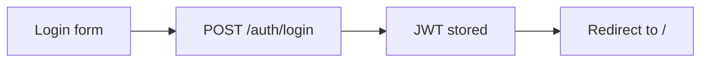
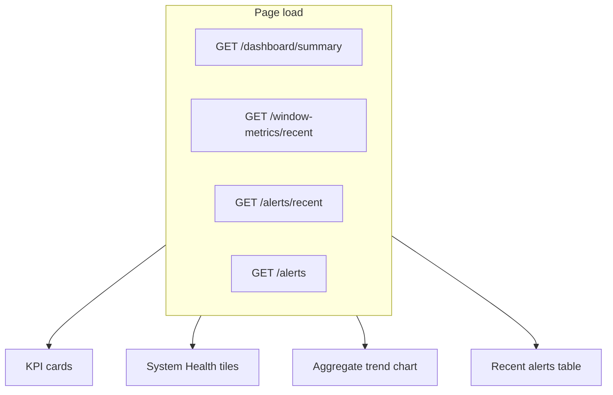
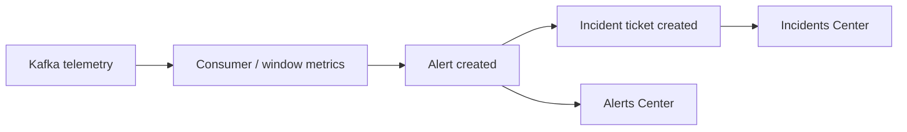

# SentryyIQ — Screen & Functional Reference

> **Related Salveris design:** [`live_data_incident_context_v1_3.md`](../../Salveris-Platform/docs/design/live_data_incident_context_v1_3.md) (lives in the **Salveris-Platform** repository under `docs/design/`; path shown is relative from this banking repo when both repos share a common parent folder).

---

## 1. Purpose and how to use this document

This reference captures **what each SentryyIQ UI surface shows**, which **fields and actions** operators can use, and how those actions map to **frontend routes** and **FastAPI endpoints**. It is intended for:

- Product and integration planning (including Salveris live-data + knowledge copilot alignment).
- Onboarding engineers to the React observability console and Copilot surfaces.
- Traceability from demo screenshots to implemented behavior in `banking-log-anomaly-detection`.

**Screenshot archive (dashboard):** extracted JPEGs at  
`C:/Shubhi/Docs/BigDocs/Images/_extract_Dashboard_Screen_Shots/` (`0.jpg`–`9.jpg`).

**Code sources of truth:**

| Area | Location |
|------|----------|
| Routes | `frontend/src/routes/` |
| API client | `frontend/src/lib/api/client.ts` |
| Alert / incident detail modals | `frontend/src/components/dashboard/details_dialog.tsx` |
| Incident workflow dialogs | `frontend/src/components/dashboard/incident-action-dialog.tsx` |
| Copilot panel | `frontend/src/components/copilot/copilot-panel.tsx` |
| Backend routes | `backend/main.py` |
| Salveris proxy | `docs/SALVERIS_COPILOT.md` |
| Telegram / n8n Copilot | `n8n/SentryyIQ_HackathonV0.9.json`, `README.md` |

**Global chrome (all authenticated Operations pages):**

- **Sidebar:** SentryyIQ Observability → Operations: Executive Dashboard, Alerts Center, Service Analytics, Incidents Center; footer shows signed-in user and **Sign out**.
- **Top bar:** page title, sidebar toggle, **Search services, alerts…** (presentational; not wired to global search API in current code), **PROD** badge, **Copilot** sheet trigger, notifications bell (placeholder), theme toggle.
- **Auth:** unauthenticated users are redirected to `/login`. Session uses JWT from `POST /auth/login`.

---

## 2. Dashboard / Observability — screen-by-screen

### 2.1 Sign in

| Attribute | Value |
|-----------|--------|
| **Screen name** | Sign in to SentryyIQ |
| **Screenshot** | *(none in archive)* |
| **Route** | `/login` |
| **Nav context** | Standalone (no sidebar) |

**Fields and actions**

| Element | Type | Behavior |
|---------|------|----------|
| Email | Required input | Submitted to login |
| Password | Required input | Submitted to login |
| Sign in | Button | Calls auth layer → `POST /auth/login` |

**API**

- `POST /auth/login` — body `{ email, password }` → `{ access_token, token_type, user }`.
- After login, client stores token; subsequent calls send `Authorization: Bearer <jwt>`.
- `GET /auth/me` — current user profile (used by auth context).

**Flow**



---

### 2.2 Executive Dashboard

| Attribute | Value |
|-----------|--------|
| **Screen name** | Executive Dashboard |
| **Screenshot** | `_extract_Dashboard_Screen_Shots/0.jpg` |
| **Route** | `/` |
| **Nav context** | Operations → Executive Dashboard (active) |

**KPI cards**

| Label | Source (API / logic) | Notes |
|-------|----------------------|-------|
| Total Alerts | `GET /dashboard/summary` → `total_alerts` | Subtitle: “Across all services” |
| Critical Alerts | `dashboard/summary` → `critical` | Accent: danger |
| Services Monitored | Derived from `GET /window-metrics/recent` | Count of distinct services in latest window per service |
| Average Risk Score | Mean of `final_score` from recent window metrics | Hint: “Mean final_score, latest window”; color by thresholds (>0.6 danger, >0.5 warning) |

**System Health Overview**

- Grid of **HealthTile** per service (from latest window metric per service).
- Health label (Critical / High / Medium / Healthy) combines service priority with open critical alerts (`getServiceHealth`).

**Anomaly Score Trend — All Services**

- Line chart of **aggregated `final_score`** bucketed by `window_end` across services.
- Data: `GET /window-metrics/recent`.

**Recent Alerts table**

| Column | Field |
|--------|--------|
| Service | `service` (display label) |
| Priority | `priority` badge |
| Status | `status` pill |

- Data: `GET /alerts/recent` (up to 6 rows shown).
- Also loads `GET /alerts` for health calculation.

**User actions → APIs**

| Action | API |
|--------|-----|
| Page load | `GET /dashboard/summary`, `GET /window-metrics/recent`, `GET /alerts/recent`, `GET /alerts` |
| Open Copilot | See §3.1 |
| Sign out | Client clears session (no API) |

**Flow**



---

### 2.3 Alerts Center

| Attribute | Value |
|-----------|--------|
| **Screen name** | Alerts Center |
| **Screenshot** | `_extract_Dashboard_Screen_Shots/1.jpg` |
| **Route** | `/alerts` |
| **Nav context** | Operations → Alerts Center |

**Summary KPI cards**

| Card | Count logic |
|------|-------------|
| Critical | `priority === "Critical"` |
| High | `priority === "High"` |
| Medium | `priority === "Medium"` |
| Open | `status === "OPEN"` |

**Filters**

| Control | Filters on |
|---------|------------|
| Search id or service… | Alert `id`, `service` |
| All priorities | `Critical`, `High`, `Medium` |
| All statuses | `OPEN`, `ASSIGNED`, `RESOLVED` |
| All services | From `GET /analytics/services` (label + count) |

**Alerts table**

| Column | Field |
|--------|--------|
| ID | `#${id}` |
| Service | `service` |
| Priority | `priority` |
| Final Score | `final_score` (3 decimals) |
| Status | `status` |
| Created | Relative time from `created_at` |
| Actions | Eye icon → **Alert Threat Telemetry** modal |

- Client-side filter; table shows first **15** matching rows (`TABLE_PAGE_SIZE`).
- Footer: “X of Y alerts” / “Showing … matching alerts”.

**User actions → APIs**

| Action | API |
|--------|-----|
| Page load | `GET /alerts`, `GET /analytics/services` |
| View alert (eye) | Opens modal; see §2.4 |

---

### 2.4 Alert Threat Telemetry (modal)

| Attribute | Value |
|-----------|--------|
| **Screen name** | Alert Threat Telemetry: #{alert_id} |
| **Screenshots** | `2.jpg` (Overview, #3161), `3.jpg` (Summary, #3159), `4.jpg` (Records, #3159) |
| **Route** | Modal on `/alerts` (also same component pattern if reused) |
| **Trigger** | Eye icon on alert row |

**Header**

| Element | Content |
|---------|---------|
| Badges | Priority + Status |
| Title | Alert Threat Telemetry: #{id} |
| Target Domain Service | `service` (display name) |
| Anomaly Engine Score | Alert `final_score` |

**Tabs**

| Tab | Content | Data source |
|-----|---------|-------------|
| **Overview** | Monospace “alert stream” block: target node, breach severity, log event time, evaluation window, metric aggregations (latency, CPU, memory, queue, errors), engine vector analysis (ML, statistical, final weighted score, prediction flag) | `GET /window-metrics` + `GET /window-metrics/details/{window_metric_id}` when dialog opens (linked via alert’s `window_metric_id` from API) |
| **Summary** | Structured summary: regions, top errors, top clients, etc. | `payload_summary` on window metric details |
| **Records** | Tabular forensic rows (EWMA, CUSUM, amount, region, status, service, endpoint, severity, client id, CPU, …); cap **50** rows displayed | `payload_json` via `JsonRecordsView` |
| **Telemetry Details** | Raw JSON blocks for payload summary and payload JSON | Same details endpoint |

**User actions → APIs**

| Action | API |
|--------|-----|
| Open dialog | `GET /window-metrics`, `GET /window-metrics/details/{id}` |
| Close | UI only |

**Note:** Overview text in UI references the real-time alert stream naming used in the product demo; backend field names align with `WindowMetric` / `WindowMetricsDetail` schemas.

---

### 2.5 Service Analytics

| Attribute | Value |
|-----------|--------|
| **Screen name** | Service Analytics |
| **Screenshots** | `8.jpg` (resource footprint chart), `9.jpg` (CUSUM + threat model charts) |
| **Route** | `/analytics` |
| **Nav context** | Operations → Service Analytics |

**Controls**

| Control | Behavior |
|---------|----------|
| Service selector | Dropdown from `GET /analytics/services` |
| Time range tabs | **1h** (last 12 points), **24h**, **7d** — `7d` uses full series like 24h in current implementation |
| Latest-window stats (when data loaded) | Prediction Status `State [prediction]`, Total Records, Error Count, Priority badge |

**Charts**

1. **Unified Resource Footprint Overlays (Normalized Variance)**  
   Normalized 0–100 overlay of latency mean, EWMA latency, queue lag, CPU, memory per window.

2. **Statistical Indicators (CUSUM Volume & Persistence Signal)**  
   CUSUM area + persistence index line.

3. **Statistical Threat Models & Composite Vectors**  
   Lines/area for composite final score, statistical score, incident probability, ML threat score (0.0–1.0).

**User actions → APIs**

| Action | API |
|--------|-----|
| Load services | `GET /analytics/services` |
| Load series | `GET /window-metrics/service/{service}` |

---

### 2.6 Incidents Center

| Attribute | Value |
|-----------|--------|
| **Screen name** | Incidents Center |
| **Screenshot** | `_extract_Dashboard_Screen_Shots/5.jpg` |
| **Route** | `/incidents` |
| **Nav context** | Operations → Incidents Center |

**Summary KPI cards (implemented UI)**

| Card | Count |
|------|-------|
| Open | `status === "OPEN"` |
| Assigned | `status === "ASSIGNED"` |
| Resolved | `status === "RESOLVED"` |
| Closed | `status === "CLOSED"` |

> **Screenshot note:** Demo image `5.jpg` labels cards “Critical Incidents”, “Assigned”, “Resolved”, and “Total Open”. The **current React app** uses the Open / Assigned / Resolved / Closed breakdown above.

**Filters**

| Control | Options |
|---------|---------|
| All priorities | Critical, High, Medium |
| All statuses | OPEN, ASSIGNED, RESOLVED, CLOSED |

**Incidents table**

| Column | Field |
|--------|--------|
| ID | Internal `#${id}` |
| Alert Id | `alert_id` |
| Ticket Id | `ticket_id` (e.g. `INC-20260710-3163`) |
| Service | `service` |
| Assigned To | `assignee` |
| Priority | `priority` |
| Status | `status` |
| Assigned On | Relative from `created_at` |
| Actions | View (eye) + workflow button |

**Row actions**

| Ticket status | Button | Next action |
|---------------|--------|-------------|
| OPEN | Assign | `ASSIGNED` |
| ASSIGNED | Resolve | `RESOLVED` |
| RESOLVED | Close | `CLOSED` |
| CLOSED | — | No workflow button |

**User actions → APIs**

| Action | API |
|--------|-----|
| Page load | `GET /tickets`, `GET /users` |
| View incident | Modal §2.7 |
| Assign / Resolve / Close | `POST /tickets/assign` (authenticated) |

**Assign / Resolve / Close dialog fields**

| Action | Required fields |
|--------|-----------------|
| Assign | Assignee (from user list), optional remarks |
| Resolve | Resolution remarks (min 5 characters) |
| Close | Closure remark + preventive action (each min 5 characters); incident must already be RESOLVED |

---

### 2.7 Incident Ticket Logs (modal)

| Attribute | Value |
|-----------|--------|
| **Screen name** | Incident Ticket Logs: #{incident_row_id} |
| **Screenshots** | `6.jpg` (Overview), `7.jpg` (Telemetry Details) |
| **Route** | Modal on `/incidents` |
| **Trigger** | Eye icon on incident row |

**Header**

| Element | Content |
|---------|---------|
| Badges | Priority + Status |
| Target Domain Service | `service` |
| Ticket Reference | `ticket_id` |
| Assigned Analyst | `assignee` |

**Tabs**

| Tab | Content |
|-----|---------|
| **Overview** | `[SYSTEM CORRELATION]` block: alert context id, assigned analyst, dispatch/notification time, ticket reference; note when no manual engineering notes |
| **Summary** | Structured view of `incident_summary` |
| **Telemetry Details** | Raw JSON of `incident_summary` (metrics_details, top_clients, top_endpoints, affected_hosts, etc.) |

**User actions → APIs**

| Action | API |
|--------|-----|
| Open dialog | Uses ticket row data from `GET /tickets` (no extra fetch on open) |

---

## 3. Copilot

SentryyIQ exposes **two Copilot surfaces**: in-dashboard (Salveris knowledge via SentryyIQ proxy) and **Telegram** (live operations + knowledge via n8n + Gemini). WhatsApp flow JPEGs referenced in product docs were not present under `C:/Shubhi/Docs/BigDocs/Images/` at documentation time; Telegram behavior below is taken from `n8n/SentryyIQ_HackathonV0.9.json` and `README.md`.

### 3.1 Dashboard Copilot panel

| Attribute | Value |
|-----------|--------|
| **Screen name** | Ask SentryyIQ Copilot |
| **Screenshot** | *(in-app sheet; not in 0–9 archive)* |
| **Location** | Top bar **Copilot** button on all main routes |
| **Route** | Overlay (no dedicated route) |

**Modes**

| Mode | UI label | API | Salveris (server-side) |
|------|----------|-----|------------------------|
| Answer | Ask | `POST /copilot/ask` `{ question, context? }` | `POST /v1/knowledge/answer` |
| Search | Search | `POST /copilot/search` `{ question, context? }` | `POST /v1/knowledge/search` |

**Response UI**

- **Answer:** answer text, optional confidence badge, list of sources (title, snippet).
- **Search:** list of hits (title, snippet, score, source) — no generated answer.

**Auth / identity**

- Requires logged-in JWT.
- Server resolves Salveris **acting principal** from `user_master.external_reference` (see `docs/SALVERIS_COPILOT.md`).
- Browser never holds Salveris credentials.

**Example utterances (knowledge / runbooks)**

- “What is the incident closure process?”
- “Tell me the SLA for payment-api.”
- “What does the operations guide say about escalation?”

**Optional context object (API contract, not yet passed from UI):**

```typescript
{ service?: string; route?: string; ticket_id?: string }
```

---

### 3.2 Telegram Copilot (n8n + Gemini)

| Attribute | Value |
|-----------|--------|
| **Channel** | Telegram bot |
| **Orchestration** | n8n workflow `SentryyIQ_HackathonV0.9.json` |
| **LLM** | Google Gemini (system prompt: SentryyIQ Operations Assistant) |

**Welcome / intent menu (product flow)**

1. **Query live operations** — incidents, dashboard summaries, alert details, telemetry.
2. **Manage incidents** — assign, resolve, close with ticket id and assignee names.
3. **Search knowledge base** — operational documentation (Google Docs tools in n8n; distinct from Salveris dashboard path).
4. **Quick commands** — `/help`, `/regions`, `/services`.

**Example utterances**

| Intent | Examples |
|--------|----------|
| Live operations | “Show open incidents”, “Give me a dashboard summary”, “Summarize incidents by severity” |
| Incident management | “Assign INC-1001 to Rahul Sharma”, “Resolve INC-1001 with remarks …”, “Close INC-1001” |
| Knowledge | “What is the incident closure process?”, “SLA for payment-api” |
| Forensics | “Raw telemetry for alert 3159”, “Details for incident 1290” |

**Telegram tool → SentryyIQ agent APIs**

| Tool purpose | HTTP |
|--------------|------|
| List / summarize incidents | `GET /agent/incidents`, severity/service summary tools |
| Incident details | `GET /agent/incidents/details/{text}` |
| Assignment history | `GET /agent/incidents/assignments/{text}` |
| Assign / resolve / close | `POST /agent/incidents/assign` |
| Alert details | `GET /agent/alerts/details/{text}` |
| Raw alert telemetry | `GET /agent/alerts/raw_data/{text}` |
| User directory (assignee validation) | `GET /agent/users` |

> **Dashboard vs Telegram:** Dashboard incident workflow uses `POST /tickets/assign` with JWT. Telegram uses `POST /agent/incidents/assign` (n8n); assign may trigger n8n email webhook on assignment.

---

## 4. Cross-screen flows

### 4.1 Detection → Alert → Incident



- Alerts appear in **Alerts Center** and **Executive Dashboard → Recent Alerts**.
- Incidents link to originating **Alert Id** in **Incidents Center**.

### 4.2 Alert triage → forensic review

1. **Alerts Center** → filter/search → open **Alert Threat Telemetry**.
2. Review **Overview** → **Summary** (errors/regions/clients) → **Records** / **Telemetry Details**.

APIs: `GET /alerts`, `GET /window-metrics/details/{window_metric_id}`.

### 4.3 Incident assignment → resolution → closure

**Dashboard path**

1. **Incidents Center** → **Assign** on OPEN ticket → select assignee → `POST /tickets/assign` `{ action: "ASSIGNED", ticket_id, assigned_to, remarks? }`.
2. **Resolve** on ASSIGNED → remarks → `action: "RESOLVED"`.
3. **Close** on RESOLVED → closure + preventive action → `action: "CLOSED"`.

**Telegram path**

- Natural language → n8n extracts ticket id, assignee, remarks → `POST /agent/incidents/assign`.
- Assignment may notify assignee via n8n **incident_assignment** email workflow.

### 4.4 Service degradation investigation

1. **Executive Dashboard** — identify hot service in health tiles or recent alerts.
2. **Service Analytics** — select service, inspect normalized resource footprint and threat vectors.
3. Optional: **Copilot Answer** for runbook/SLA; **Alert Threat Telemetry** for row-level forensics.

### 4.5 Knowledge vs live data (Copilot split)

| Need | Surface |
|------|---------|
| Grounded enterprise knowledge + citations | Dashboard Copilot → Salveris |
| Live incident list, assign, resolve, raw telemetry | Telegram Copilot → `/agent/*` APIs |

---

## 5. Index

| Screen / surface | Image file | Route | Key APIs |
|------------------|------------|-------|----------|
| Sign in | — | `/login` | `POST /auth/login`, `GET /auth/me` |
| Executive Dashboard | `0.jpg` | `/` | `GET /dashboard/summary`, `GET /window-metrics/recent`, `GET /alerts`, `GET /alerts/recent` |
| Alerts Center | `1.jpg` | `/alerts` | `GET /alerts`, `GET /analytics/services` |
| Alert Threat Telemetry | `2.jpg`, `3.jpg`, `4.jpg` | Modal on `/alerts` | `GET /window-metrics`, `GET /window-metrics/details/{id}` |
| Service Analytics | `8.jpg`, `9.jpg` | `/analytics` | `GET /analytics/services`, `GET /window-metrics/service/{service}` |
| Incidents Center | `5.jpg` | `/incidents` | `GET /tickets`, `GET /users`, `POST /tickets/assign` |
| Incident Ticket Logs | `6.jpg`, `7.jpg` | Modal on `/incidents` | Data from `GET /tickets` |
| Dashboard Copilot | — | Top bar sheet | `POST /copilot/ask`, `POST /copilot/search` |
| Telegram Copilot | — (see n8n / README) | Telegram | `GET/POST /agent/*` |

**Supporting / health**

| Endpoint | Use |
|----------|-----|
| `GET /health` | Liveness |
| `GET /alerts/{alert_id}` | Single alert (client helper) |
| `GET /tickets/{id}` | Single ticket (client helper) |
| `GET /window-metrics/{metric_id}` | Single window metric |

---

## Document metadata

| Item | Value |
|------|--------|
| **Screens / surfaces documented** | **9** (Login, Executive Dashboard, Alerts Center, Alert Threat Telemetry modal, Service Analytics, Incidents Center, Incident Ticket Logs modal, Dashboard Copilot panel, Telegram Copilot flow) |
| **Screenshot files mapped** | **10** (`0.jpg`–`9.jpg`) |
| **Repository** | `banking-log-anomaly-detection` |
| **Last aligned to code** | Frontend routes + `backend/main.py` as of documentation date |
