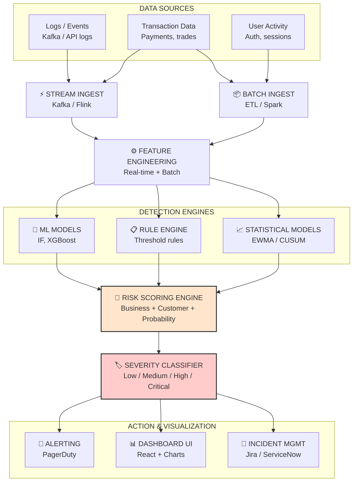

#1. Risk Scoriong : High-Level Architecture 


# 2. Core Component Design

## 2.1 Feature Engineering Layer `(MOST IMPORTANT)`
This layer extracts multi-dimensional metrics across different windows to feed the downstream detection engines.

* ### 📊 Real-Time Features
    * `request_failure_rate` (5-minute sliding window)
    * `latency_p95` (tail latency tracking)
    * `error_burst_count` (sudden traffic spikes)
    * `affected_users` (blast radius indicator)
    * `transaction_volume_drop`
    * `anomaly_score` (injected from the streaming ML model)

* ### 💼 Business Features
    * `revenue_at_risk` (monetary impact calculation)
    * `service_criticality_weight` (tiering based on component importance)
    * `SLA_breach_count`
    * `regulatory_flag` (compliance exposure)

* ### 👥 Customer Features
    * `failed_txn_per_user`
    * `auth_failures_per_session`
    * `user_impact_ratio`

## 2.2 ML + Statistical Layer
A dual-engine setup combining statistical stability tracking with probabilistic machine learning models.

## 2.3 Risk Scoring Engine `(Core Brain)`
This engine synthesizes statistical data, machine learning outputs, and operational context into a single normalized composite metric.

### 📐 Risk Formula
The system evaluates absolute risk using a weighted linear combination:

$$\text{RiskScore} = (0.35 \times \text{MLProbability}) + (0.25 \times \text{BusinessImpact}) + (0.25 \times \text{CustomerImpact}) + (0.15 \times \text{StatisticalRisk})$$

### 🔧 Sub-Engine Components
* **Business Impact Component:**
    $$\text{Business Impact} = \text{financial\\_loss} + \text{SLA\\_breach} + \text{service\\_weight} + \text{regulatory\\_risk}$$
* **Customer Impact Component:**
    $$\text{Customer Impact} = \text{request\\_fail\\_rate} + \text{affected\\_users} + \text{latency\\_degradation} + \text{txn\\_fail\\_rate}$$
* **Statistical Risk Component:**
    $$\text{Statistical Risk} = \text{EWMA\\_spike} + \text{CUSUM\\_shift} + \text{persistence\\_score}$$

# 3. Severity Classification Layer

The calculated `RiskScore` maps to standard operational severities, subject to short-circuit deterministic logic.

| Risk Score Range | Severity Level |
| :--- | :--- |
| **0.00 – 0.30** | 🟢 Low |
| **0.30 – 0.55** | 🟡 Medium |
| **0.55 – 0.75** | 🟠 High |
| **0.75 – 1.00** | 🔴 Critical |

### 🛑 Hard Deterministic Override Rules
Regardless of the composite score, the system will **force-escalate to CRITICAL** immediately if any of the following conditions are met:
1. `payment-api` is down.
2. A significant fraud spike is detected.
3. Core authentication (`auth`) system failure occurs.
4. A multi-service outage is detected.
5. A sustained data anomaly lasts for more than 15 minutes ($>15 \text{ min}$).

***

# 4. Real-Time Flow (Kafka-Based)

### Data Pipeline Architecture
```text
Kafka Topic ──> Stream Processor ──> Feature Builder ──> Model Scoring ──> Risk Engine ──> Alert Dispatcher
```
### 📋 Operational Walkthrough Example

$$\text{Initial state: System log arrives}$$
$$\text{Feature Engine action: }\text{feature\\_updated}\text{ (5-min window)}$$
$$\text{ML prediction: }\text{anomaly\\_probability} = 0.82$$
$$\text{Business context: }\text{business\\_impact} = 0.75$$
$$\text{Customer impact: }\text{customer\\_impact} = 0.68$$
$$\text{Engine calculation: }\text{final\\_risk} = 0.77 \longrightarrow \text{CRITICAL} \longrightarrow \text{Alert Fired}$$

***

# 5. Dashboard Layer (UI Observability)

The real-time operational frontend displays the following analytics widgets:
* **Risk Score:** A high-precision real-time circular gauge.
* **Severity Heatmap:** A visual matrix showing risk levels mapped across active running services.
* **Top Risky Services:** A live list ranking system components by immediate threat score.
* **Anomaly Timeline:** A chronological stream tracking historical and active drift incidents.
* **Impact Split:** A comparative chart displaying Business vs. Customer blast radius metrics side by side.
* **Trend Component:** An overlay line chart reflecting current `EWMA` and `CUSUM` calculations.

***

# 6. System Design Strengths

This production-ready architecture leverages enterprise-grade engineering principles:

* **✔ Low-Latency Streaming Systems** Utilizes an event-driven core supported by `Kafka` and `Flink` to evaluate threats in near real-time.
* **✔ Hybrid ML + Rule-Based Engine** Avoids pure-play black box ML vulnerabilities by pairing probabilistic models with strict deterministic guardrails and override rules.
* **✔ Multi-Dimensional Risk Synthesis** Goes beyond simple statistical anomalies by factoring in real-world business context and blast radius indicators before raising alerts.
* **✔ Built for Advanced Observability** Designed explicitly to align with modern operational frameworks like `Datadog`, `Splunk`, and `NewRelic`.
